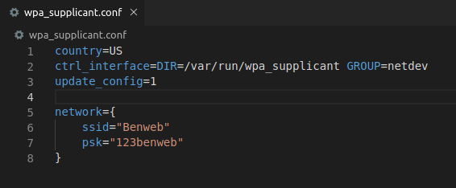
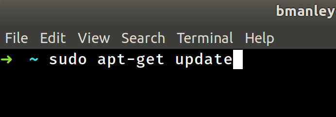

# Intro to Raspberry Pi
##
## Overview:
### - Introduction to hardware
### - Recommended setup software
### - Initial Pi setup
### - Pick and install a program 
### a.) RetroPie - Retro game console emulator
### b.) Kodi - Home media center
### - Resources
### - Future projects
##
     
# Getting to know your Pi
## Different Pi models
### - Raspberry Pi 4

### - Specs

     
### - Raspberry Pi 3

### - Specs

     
### - Raspberry Pi 2

### - Specs

     
### - Raspberry Pi Zero / Zero W

### - Specs

     
# Recommended setup software

### - [Etcher](https://www.balena.io/etcher/) - This software handles everything you need to put an image on your SD card(Windows/Mac/Linux)

## Operating system
### - [raspberrypi.org Downloads page](https://www.raspberrypi.org/downloads/)
### - Several options are available

### - NOOBS (New Out Of the Box Software)will install over the network, and requires KVM (Keyboard/Video/Mouse) to use properly
### - Since we all love using our terminals (and we're not noobs), we'll be setting up our devices directly with the Raspbian Buster image files
### - There are still a few options:

### - Each of these versions works with all of the Pi models
### - Buster Lite: Use for headless installs (no desktop GUI, just the terminal)
### - Buster with Desktop: Use for simple Raspberry Pi projects that don't require many extra libraries to run
### - Buster with Desktop/Software: Use for projects requiring additional software to be used in the desktop GUI
     

# Initial Pi Setup
## Flash the SD card
### - Run Etcher and select the .img file that you're using
### - The Pi can be used now, but we haven't set up a wifi network to connect to it remotely!
### - To connect to our devices remotely, we'll be using SSH in the terminal
### - To access the Pi over the network, we'll need to tell it two things:
- How to connect to a wireless network
- To enable SSH for remote connections (disabled by default for security)

     
# Enable SSH / Configure Wi-Fi
## Open a file manager on your computer and navigate to the SD card

### - You should notice two partitions: 'boot' and 'rootfs'
### - Navigate to the 'boot' partition
### - Open a terminal window in this directory by right clicking inside the folder

### - Create a file with the name 'ssh'
### - Do NOT give the file an extension such as .txt or .exe
### - Create another file with the name 'wpa_supplicant.conf'
### - Open up this file in your code editor of choice to enter your Wi-Fi credentials

### - Don't forget to SAVE your file before exiting your code editor!!!
     
# Install SD card / Fire it up!
### - Insert the SD card into the Raspberry Pi
### - Wait for the initial files to unpack and for the device to configure itself
### - We'll look at the ip addresses of the devices as they connect to our test network so that we can use them for SSH
     
# SSH into the Pi

### - The default username for the device is 'pi'
### - The default password for the device is 'raspberry'
### - Congrats!  You're logged into your device!
     
# Changing default settings

### - Access the configuration menu by typing 'sudo raspi-config'
### - Change the device name
### - Change the default password
### - This is also where you enable GPIO (General Purpose Input Output) pins, the camera, and other features on the device
### - If neccesary, change your Wi-Fi config 
     
# Update the device

### - To check for updates and update your device, type 'sudo apt-get update' and then 'sudo apt-get upgrade'
### - Congrats!  You're ready to start using your device!
     
# What to do now?
## Here are some fun options:
### [Install Kodi](https://www.makeuseof.com/tag/install-kodi-raspbian-media-center/) - Home Media Center

### [Install RetroPie](https://retropie.org.uk/docs/Manual-Installation/) - Retro video game emulator

### - Explore!  There are a BAZILLION different guides and tutorials all over the web that outline everything from simple code to make an LED light up, to building robots.

# Ideas for next week
## - Demo ideas?
### - GPIO demo
### - Camera demo
### - Utilize the Slack channel and we can discuss ideas

     

# Resources:
### - [raspberrypi.org](https://www.raspberrypi.org)
### - [raspberrypi.org - New device setup walkthrough](https://projects.raspberrypi.org/en/projects/raspberry-pi-setting-up)
### - [raspberrypi.org - Downloads page](https://www.raspberrypi.org/downloads/)
### - [raspberrypi.org - Getting started with soldering](https://projects.raspberrypi.org/en/projects/getting-started-with-soldering)
